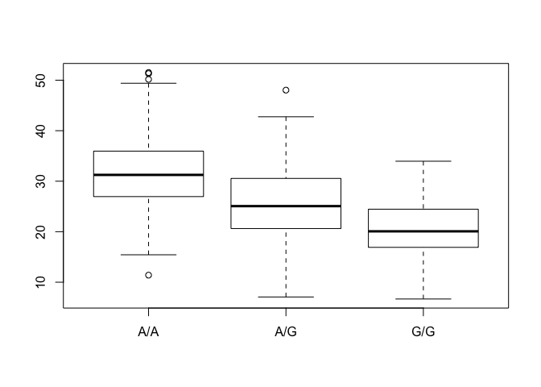

Class 14: Genome Informatics and High Throughput Sequencing
================
Paige Dubelko
February 21, 2019

Asthma SNPs in MXL population
-----------------------------

Read in the csv file we downloaded from [Ensembl](http://uswest.ensembl.org/Homo_sapiens/Variation/Sample?db=core;r=17:39894595-39895595;v=rs8067378;vdb=variation;vf=362656008#373531_tablePanel)

``` r
mxl <- read.csv("class14MXL.csv", row.names = 1)
head(mxl)
```

    ##             Genotype..forward.strand. Population.s. Father Mother
    ## NA19648 (F)                       A|A ALL, AMR, MXL      -      -
    ## NA19649 (M)                       G|G ALL, AMR, MXL      -      -
    ## NA19651 (F)                       A|A ALL, AMR, MXL      -      -
    ## NA19652 (M)                       G|G ALL, AMR, MXL      -      -
    ## NA19654 (F)                       G|G ALL, AMR, MXL      -      -
    ## NA19655 (M)                       A|G ALL, AMR, MXL      -      -

How many G|G genotypes are in this set? Perecent values?

``` r
table(mxl$Genotype..forward.strand.)
```

    ## 
    ## A|A A|G G|A G|G 
    ##  22  21  12   9

``` r
#table(mxl$Genotype..forward.strand.)/nrow(mxl)*100
```

RNA-Seq
-------

Fastq quality scores

Q. Does the first sequence have good quality?

``` r
#install.packages("seqinr")
#install.packages("gtools")

q <- "DDDDCDEDCDDDDBBDDDCC@"
library(seqinr)
library(gtools)
asc(s2c(q)) - 33 #bc of offset
```

    ##  D  D  D  D  C  D  E  D  C  D  D  D  D  B  B  D  D  D  C  C  @ 
    ## 35 35 35 35 34 35 36 35 34 35 35 35 35 33 33 35 35 35 34 34 31

Population scale analysis
-------------------------

Does the genotype for rs9067378 influence expression of the important asthema linked genes we found?

``` r
geno <- read.table("230Samples.txt")
head(geno)
```

    ##    sample geno      exp
    ## 1 HG00367  A/G 28.96038
    ## 2 NA20768  A/G 20.24449
    ## 3 HG00361  A/A 31.32628
    ## 4 HG00135  A/A 34.11169
    ## 5 NA18870  G/G 18.25141
    ## 6 NA11993  A/A 32.89721

Find how many patients are G|G?

``` r
table(geno$geno)
```

    ## 
    ## A/A A/G G/G 
    ## 108 233 121

Find expression values for G|G

``` r
inds <- geno$geno == "G/G"
summary(geno$exp[inds])
```

    ##    Min. 1st Qu.  Median    Mean 3rd Qu.    Max. 
    ##   6.675  16.900  20.070  20.590  24.460  33.960

Find expression values for A|A

``` r
inds.aa <- geno$geno == "A/A"
summary(geno$exp[inds.aa])
```

    ##    Min. 1st Qu.  Median    Mean 3rd Qu.    Max. 
    ##   11.40   27.02   31.25   31.82   35.92   51.52

Find expression values for A|G

``` r
inds.ag <- geno$geno == "A/G"
summary(geno$exp[inds.ag])
```

    ##    Min. 1st Qu.  Median    Mean 3rd Qu.    Max. 
    ##   7.075  20.630  25.060  25.400  30.550  48.030

Create a figure that shows the distribution of these expression value

``` r
#want expression spit by genotype
graph <- boxplot(exp ~ geno, geno)
```


