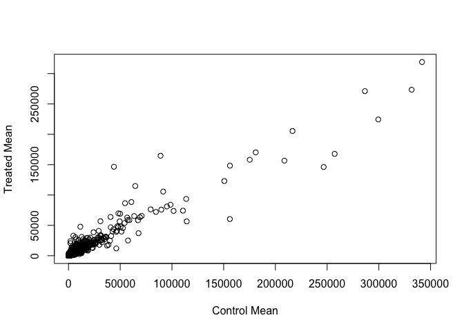
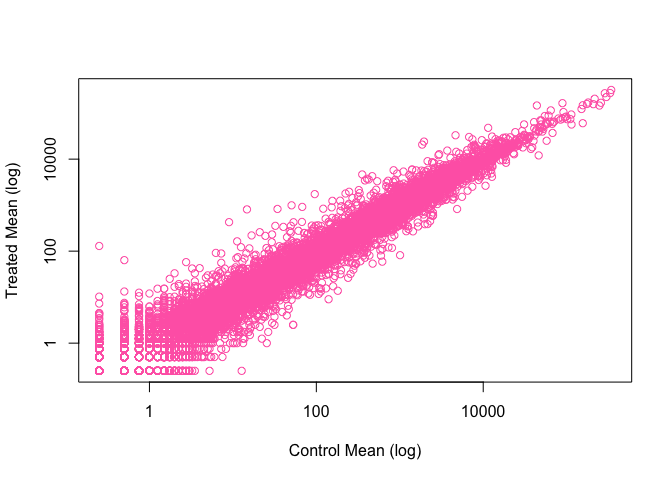
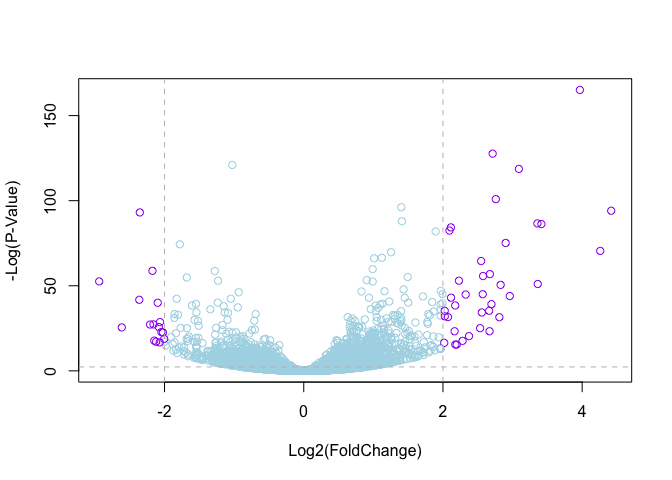

Class 15: Transcriptomics and RNA-Seq analysis
================
Paige Dubelko

``` r
#we will be using DESeq2 toay
library(BiocInstaller)
```

    ## Bioconductor version 3.4 (BiocInstaller 1.24.0), ?biocLite for help

    ## A new version of Bioconductor is available after installing the most
    ##   recent version of R; see http://bioconductor.org/install

Import countData and colData into R
-----------------------------------

``` r
metaData <- read.csv("data/airway_metadata.csv", header = TRUE, stringsAsFactors = FALSE)
counts <- read.csv("data/airway_scaledcounts.csv", stringsAsFactors = FALSE)
#head(metaData)
#head(counts)
```

Check for correspondance of metadata and countdata

``` r
all(colnames(counts[-1]) == metaData$id)
```

    ## [1] TRUE

Find which columns in *counts* correspond to the control conditions (i.e. no drug). Then we can calculate the mean count value for each gene.

``` r
control.inds <- metaData$dex == "control"
#head(counts[-1][,control.inds])

head(counts[,metaData$id[control.inds]])
```

    ##   SRR1039508 SRR1039512 SRR1039516 SRR1039520
    ## 1        723        904       1170        806
    ## 2          0          0          0          0
    ## 3        467        616        582        417
    ## 4        347        364        318        330
    ## 5         96         73        118        102
    ## 6          0          1          2          0

Calculate mean value

``` r
controlMean <- rowSums(counts[,metaData$id[control.inds]])/ ncol(counts[,metaData$id[control.inds]])
```

Now do the same thing for the drug treated samples (i.e. *treated* columns)

``` r
treated.inds <- metaData$dex == "treated"
treated.id <- metaData$id[treated.inds]

treatedMean <- rowSums(counts[,treated.id])/ncol(counts[,treated.id])
```

Add gene names back in

``` r
names(controlMean) <- counts$ensgene
names(treatedMean) <- counts$ensgene
```

Combine our mean count data for control and trated into a new data.frame

``` r
meancounts <- data.frame(controlMean,treatedMean)
```

Look at column summary

``` r
colSums(meancounts)
```

    ## controlMean treatedMean 
    ##    23005324    22196524

Now we can plot the drug treated vs non-drug control count values

``` r
plot(meancounts$controlMean, meancounts$treatedMean, xlab = "Control Mean",
      ylab = "Treated Mean")
```



After seeing this plot and condensed data, lets log2 transform the data

``` r
plot(meancounts$controlMean, meancounts$treatedMean, xlab = "Control Mean (log)",
      ylab = "Treated Mean (log)", log = "xy", col = "hotpink")
```

    ## Warning in xy.coords(x, y, xlabel, ylabel, log): 15032 x values <= 0
    ## omitted from logarithmic plot

    ## Warning in xy.coords(x, y, xlabel, ylabel, log): 15281 y values <= 0
    ## omitted from logarithmic plot



This will show us which genes goes up when we are treating them. The drug enhances which genes.

``` r
meancounts$log2fc <- log2(meancounts[,"treatedMean"]/meancounts[,"controlMean"])
head(meancounts)
```

    ##                 controlMean treatedMean      log2fc
    ## ENSG00000000003      900.75      658.00 -0.45303916
    ## ENSG00000000005        0.00        0.00         NaN
    ## ENSG00000000419      520.50      546.00  0.06900279
    ## ENSG00000000457      339.75      316.50 -0.10226805
    ## ENSG00000000460       97.25       78.75 -0.30441833
    ## ENSG00000000938        0.75        0.00        -Inf

Remove the zero entry genes from meancount to produce **mycounts**

``` r
zero.vals <- which(meancounts[,1:2] == 0, arr.ind = TRUE)
to.rm <- unique(zero.vals[,1])

mycounts <- meancounts[-to.rm,]
head(mycounts)
```

    ##                 controlMean treatedMean      log2fc
    ## ENSG00000000003      900.75      658.00 -0.45303916
    ## ENSG00000000419      520.50      546.00  0.06900279
    ## ENSG00000000457      339.75      316.50 -0.10226805
    ## ENSG00000000460       97.25       78.75 -0.30441833
    ## ENSG00000000971     5219.00     6687.50  0.35769358
    ## ENSG00000001036     2327.00     1785.75 -0.38194109

Lets see how many of our genes are up-regulated and down-regulated

``` r
up.ind <- mycounts$log2fc > 2
down.ind <- mycounts$log2fc < -2
```

``` r
sum(up.ind)
```

    ## [1] 250

``` r
sum(down.ind)
```

    ## [1] 367

There are `sum(up.ind)` up regulated genes and `sum(down.ind)` down regulated genes.

To see the list of all upregulated genes:

``` r
head(mycounts[up.ind,])
```

    ##                 controlMean treatedMean   log2fc
    ## ENSG00000004799      270.50     1429.25 2.401558
    ## ENSG00000006788        2.75       19.75 2.844349
    ## ENSG00000008438        0.50        2.75 2.459432
    ## ENSG00000011677        0.50        2.25 2.169925
    ## ENSG00000015413        0.50        3.00 2.584963
    ## ENSG00000015592        0.50        2.25 2.169925

Add annotation data
===================

We can download a file from Ensembl

``` r
anno <- read.csv("data/annotables_grch38.csv")
head(anno)
```

    ##           ensgene entrez   symbol chr     start       end strand
    ## 1 ENSG00000000003   7105   TSPAN6   X 100627109 100639991     -1
    ## 2 ENSG00000000005  64102     TNMD   X 100584802 100599885      1
    ## 3 ENSG00000000419   8813     DPM1  20  50934867  50958555     -1
    ## 4 ENSG00000000457  57147    SCYL3   1 169849631 169894267     -1
    ## 5 ENSG00000000460  55732 C1orf112   1 169662007 169854080      1
    ## 6 ENSG00000000938   2268      FGR   1  27612064  27635277     -1
    ##          biotype
    ## 1 protein_coding
    ## 2 protein_coding
    ## 3 protein_coding
    ## 4 protein_coding
    ## 5 protein_coding
    ## 6 protein_coding
    ##                                                                                                  description
    ## 1                                                          tetraspanin 6 [Source:HGNC Symbol;Acc:HGNC:11858]
    ## 2                                                            tenomodulin [Source:HGNC Symbol;Acc:HGNC:17757]
    ## 3 dolichyl-phosphate mannosyltransferase polypeptide 1, catalytic subunit [Source:HGNC Symbol;Acc:HGNC:3005]
    ## 4                                               SCY1-like, kinase-like 3 [Source:HGNC Symbol;Acc:HGNC:19285]
    ## 5                                    chromosome 1 open reading frame 112 [Source:HGNC Symbol;Acc:HGNC:25565]
    ## 6                          FGR proto-oncogene, Src family tyrosine kinase [Source:HGNC Symbol;Acc:HGNC:3697]

We want to merge this annotation data with our mycounts data. Use **the merge()** function, x will be **mycounts** and y will be the **annotation data**

``` r
mycounts.anno <- merge(mycounts, anno, by.x = "row.names", by.y = "ensgene" )
head(mycounts.anno)
```

    ##         Row.names controlMean treatedMean      log2fc entrez   symbol chr
    ## 1 ENSG00000000003      900.75      658.00 -0.45303916   7105   TSPAN6   X
    ## 2 ENSG00000000419      520.50      546.00  0.06900279   8813     DPM1  20
    ## 3 ENSG00000000457      339.75      316.50 -0.10226805  57147    SCYL3   1
    ## 4 ENSG00000000460       97.25       78.75 -0.30441833  55732 C1orf112   1
    ## 5 ENSG00000000971     5219.00     6687.50  0.35769358   3075      CFH   1
    ## 6 ENSG00000001036     2327.00     1785.75 -0.38194109   2519    FUCA2   6
    ##       start       end strand        biotype
    ## 1 100627109 100639991     -1 protein_coding
    ## 2  50934867  50958555     -1 protein_coding
    ## 3 169849631 169894267     -1 protein_coding
    ## 4 169662007 169854080      1 protein_coding
    ## 5 196651878 196747504      1 protein_coding
    ## 6 143494811 143511690     -1 protein_coding
    ##                                                                                                  description
    ## 1                                                          tetraspanin 6 [Source:HGNC Symbol;Acc:HGNC:11858]
    ## 2 dolichyl-phosphate mannosyltransferase polypeptide 1, catalytic subunit [Source:HGNC Symbol;Acc:HGNC:3005]
    ## 3                                               SCY1-like, kinase-like 3 [Source:HGNC Symbol;Acc:HGNC:19285]
    ## 4                                    chromosome 1 open reading frame 112 [Source:HGNC Symbol;Acc:HGNC:25565]
    ## 5                                                     complement factor H [Source:HGNC Symbol;Acc:HGNC:4883]
    ## 6                                          fucosidase, alpha-L- 2, plasma [Source:HGNC Symbol;Acc:HGNC:4008]

DESeq2 Analysis
---------------

Now we do this analysis properly with p-values!

``` r
library(DESeq2)
```

    ## Loading required package: S4Vectors

    ## Loading required package: stats4

    ## Loading required package: BiocGenerics

    ## Loading required package: parallel

    ## 
    ## Attaching package: 'BiocGenerics'

    ## The following objects are masked from 'package:parallel':
    ## 
    ##     clusterApply, clusterApplyLB, clusterCall, clusterEvalQ,
    ##     clusterExport, clusterMap, parApply, parCapply, parLapply,
    ##     parLapplyLB, parRapply, parSapply, parSapplyLB

    ## The following objects are masked from 'package:stats':
    ## 
    ##     IQR, mad, xtabs

    ## The following objects are masked from 'package:base':
    ## 
    ##     anyDuplicated, append, as.data.frame, cbind, colnames,
    ##     do.call, duplicated, eval, evalq, Filter, Find, get, grep,
    ##     grepl, intersect, is.unsorted, lapply, lengths, Map, mapply,
    ##     match, mget, order, paste, pmax, pmax.int, pmin, pmin.int,
    ##     Position, rank, rbind, Reduce, rownames, sapply, setdiff,
    ##     sort, table, tapply, union, unique, unsplit, which, which.max,
    ##     which.min

    ## 
    ## Attaching package: 'S4Vectors'

    ## The following objects are masked from 'package:base':
    ## 
    ##     colMeans, colSums, expand.grid, rowMeans, rowSums

    ## Loading required package: IRanges

    ## Loading required package: GenomicRanges

    ## Loading required package: GenomeInfoDb

    ## Loading required package: SummarizedExperiment

    ## Loading required package: Biobase

    ## Welcome to Bioconductor
    ## 
    ##     Vignettes contain introductory material; view with
    ##     'browseVignettes()'. To cite Bioconductor, see
    ##     'citation("Biobase")', and for packages 'citation("pkgname")'.

``` r
citation("DESeq2")
```

    ## 
    ##   Michael I Love, Wolfgang Huber and Simon Anders (2014):
    ##   Moderated estimation of fold change and dispersion for RNA-Seq
    ##   data with DESeq2. Genome Biology
    ## 
    ## A BibTeX entry for LaTeX users is
    ## 
    ##   @Article{,
    ##     title = {Moderated estimation of fold change and dispersion for RNA-seq data with DESeq2},
    ##     author = {Michael I Love and Wolfgang Huber and Simon Anders},
    ##     year = {2014},
    ##     journal = {Genome Biology},
    ##     doi = {10.1186/s13059-014-0550-8},
    ##     volume = {15},
    ##     issue = {12},
    ##     pages = {550},
    ##   }

``` r
dds <- DESeqDataSetFromMatrix(countData = counts, colData = metaData, design = ~dex,
                                tidy = TRUE)
```

    ## converting counts to integer mode

    ## Warning in DESeqDataSet(se, design = design, ignoreRank): some variables in
    ## design formula are characters, converting to factors

``` r
dds
```

    ## class: DESeqDataSet 
    ## dim: 38694 8 
    ## metadata(1): version
    ## assays(1): counts
    ## rownames(38694): ENSG00000000003 ENSG00000000005 ...
    ##   ENSG00000283120 ENSG00000283123
    ## rowData names(0):
    ## colnames(8): SRR1039508 SRR1039509 ... SRR1039520 SRR1039521
    ## colData names(4): id dex celltype geo_id

``` r
dds <- DESeq(dds)
```

    ## estimating size factors

    ## estimating dispersions

    ## gene-wise dispersion estimates

    ## mean-dispersion relationship

    ## final dispersion estimates

    ## fitting model and testing

``` r
res <- results(dds)
res05 <- results(dds, alpha = 0.01)
summary(res)
```

    ## 
    ## out of 25258 with nonzero total read count
    ## adjusted p-value < 0.1
    ## LFC > 0 (up)     : 1560, 6.2% 
    ## LFC < 0 (down)   : 1189, 4.7% 
    ## outliers [1]     : 212, 0.84% 
    ## low counts [2]   : 9918, 39% 
    ## (mean count < 10)
    ## [1] see 'cooksCutoff' argument of ?results
    ## [2] see 'independentFiltering' argument of ?results

Plot a volcano graph

``` r
mycols <- rep("lightblue", nrow(res))
mycols[abs(res$log2FoldChange)>2] <- "hotpink"

inds <- (res$padj < 0.01) & (abs(res$log2FoldChange) > 2)
mycols[inds] <- "purple"

plot(res$log2FoldChange, -log(res$padj), col = mycols, ylab = "-Log(P-Value)", 
      xlab = "Log2(FoldChange)")

abline(v = c(-2,2), col = "gray", lty = 2)
abline(h = -log(0.1), col = "gray", lty = 2)
```


