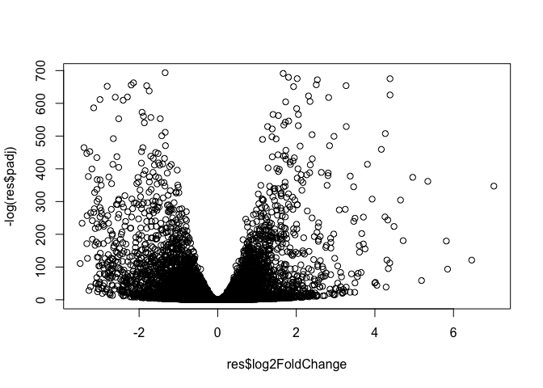
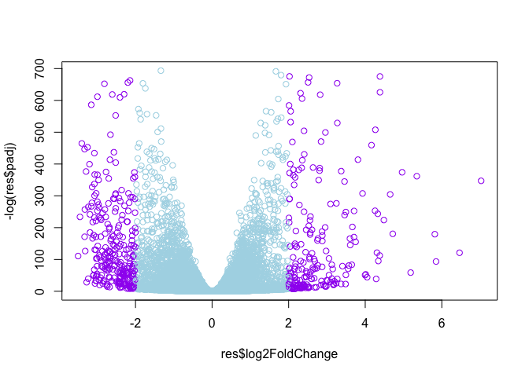

Class 16
================
Paige Dubelko
February 28, 2019

Differential Expression Analysis
--------------------------------

Load our data files

``` r
metaFile <- "data/GSE37704_metadata.csv"
countFile <-"data/GSE37704_featurecounts.csv"

#Import metadata
colData = read.csv(metaFile, row.names = 1)
head(colData)
```

    ##               condition
    ## SRR493366 control_sirna
    ## SRR493367 control_sirna
    ## SRR493368 control_sirna
    ## SRR493369      hoxa1_kd
    ## SRR493370      hoxa1_kd
    ## SRR493371      hoxa1_kd

``` r
#Import countdata
countData = read.csv(countFile, row.names = 1)
countData = as.matrix(countData[,-1])
head(countData)
```

    ##                 SRR493366 SRR493367 SRR493368 SRR493369 SRR493370
    ## ENSG00000186092         0         0         0         0         0
    ## ENSG00000279928         0         0         0         0         0
    ## ENSG00000279457        23        28        29        29        28
    ## ENSG00000278566         0         0         0         0         0
    ## ENSG00000273547         0         0         0         0         0
    ## ENSG00000187634       124       123       205       207       212
    ##                 SRR493371
    ## ENSG00000186092         0
    ## ENSG00000279928         0
    ## ENSG00000279457        46
    ## ENSG00000278566         0
    ## ENSG00000273547         0
    ## ENSG00000187634       258

Check that my metadata and coldata columns are equal

``` r
all(row.names(colData) == colnames(countData))
```

    ## [1] TRUE

Lets remove genes that we do not have data for (e.g. zeros across all columns)

``` r
inds <- rowSums(countData) != 0
countData = countData[inds,]
head(countData)
```

    ##                 SRR493366 SRR493367 SRR493368 SRR493369 SRR493370
    ## ENSG00000279457        23        28        29        29        28
    ## ENSG00000187634       124       123       205       207       212
    ## ENSG00000188976      1637      1831      2383      1226      1326
    ## ENSG00000187961       120       153       180       236       255
    ## ENSG00000187583        24        48        65        44        48
    ## ENSG00000187642         4         9        16        14        16
    ##                 SRR493371
    ## ENSG00000279457        46
    ## ENSG00000187634       258
    ## ENSG00000188976      1504
    ## ENSG00000187961       357
    ## ENSG00000187583        64
    ## ENSG00000187642        16

Running DESeq2
--------------

``` r
library("DESeq2")
```

``` r
dds = DESeqDataSetFromMatrix(countData = countData, colData = colData, 
                              design =~condition)
dds = DESeq(dds)
```

    ## estimating size factors

    ## estimating dispersions

    ## gene-wise dispersion estimates

    ## mean-dispersion relationship

    ## final dispersion estimates

    ## fitting model and testing

Lets get our results

``` r
res = results(dds,contrast = c("condition", "hoxa1_kd", "control_sirna"))
summary(res)
```

    ## 
    ## out of 15975 with nonzero total read count
    ## adjusted p-value < 0.1
    ## LFC > 0 (up)     : 4367, 27% 
    ## LFC < 0 (down)   : 4417, 28% 
    ## outliers [1]     : 0, 0% 
    ## low counts [2]   : 1548, 9.7% 
    ## (mean count < 1)
    ## [1] see 'cooksCutoff' argument of ?results
    ## [2] see 'independentFiltering' argument of ?results

Lets make our volcano plot

``` r
plot(res$log2FoldChange, -log(res$padj))
```



``` r
mycols <- rep("lightblue", nrow(res))
mycols[abs(res$log2FoldChange )> 2] <- "hotpink"
inds <- (abs(res$log2FoldChange) > 2) & (res$padj < 0.01)
mycols[inds] <- "purple"
plot(res$log2FoldChange, -log(res$padj), col = mycols)
```



``` r
source("http://bioconductor.org/biocLite.R")
biocLite("AnnotationDbi")
biocLite("org.Hs.eg.db")
```

``` r
library("AnnotationDbi")
library("org.Hs.eg.db")

columns(org.Hs.eg.db)
```

    ##  [1] "ACCNUM"       "ALIAS"        "ENSEMBL"      "ENSEMBLPROT" 
    ##  [5] "ENSEMBLTRANS" "ENTREZID"     "ENZYME"       "EVIDENCE"    
    ##  [9] "EVIDENCEALL"  "GENENAME"     "GO"           "GOALL"       
    ## [13] "IPI"          "MAP"          "OMIM"         "ONTOLOGY"    
    ## [17] "ONTOLOGYALL"  "PATH"         "PFAM"         "PMID"        
    ## [21] "PROSITE"      "REFSEQ"       "SYMBOL"       "UCSCKG"      
    ## [25] "UNIGENE"      "UNIPROT"

``` r
res$symbol = mapIds(org.Hs.eg.db, keys = row.names(res) , keytype = "ENSEMBL",
                      column = "SYMBOL", multiVals = "first")
```

    ## 'select()' returned 1:many mapping between keys and columns

``` r
res$entrez = mapIds(org.Hs.eg.db, keys = row.names(res), keytype = "ENSEMBL",
                      column = "ENTREZID", multiVals = "first")
```

    ## 'select()' returned 1:many mapping between keys and columns

``` r
res$name = mapIds(org.Hs.eg.db, keys = row.names(res), keytype = "ENSEMBL",
                      column = "GENENAME", multiVals = "first")
```

    ## 'select()' returned 1:many mapping between keys and columns

``` r
head(res)
```

    ## log2 fold change (MAP): condition hoxa1_kd vs control_sirna 
    ## Wald test p-value: condition hoxa1_kd vs control_sirna 
    ## DataFrame with 6 rows and 9 columns
    ##                   baseMean log2FoldChange      lfcSE        stat
    ##                  <numeric>      <numeric>  <numeric>   <numeric>
    ## ENSG00000279457   29.91358      0.1657155 0.29999393   0.5523961
    ## ENSG00000187634  183.22965      0.4200459 0.13805437   3.0426121
    ## ENSG00000188976 1651.18808     -0.6911058 0.05471529 -12.6309448
    ## ENSG00000187961  209.63794      0.7200569 0.12999252   5.5392180
    ## ENSG00000187583   47.25512      0.0383645 0.25695539   0.1493041
    ## ENSG00000187642   11.97975      0.4488311 0.42972207   1.0444683
    ##                       pvalue         padj       symbol      entrez
    ##                    <numeric>    <numeric>  <character> <character>
    ## ENSG00000279457 5.806770e-01 6.789940e-01 LOC102723897   102723897
    ## ENSG00000187634 2.345345e-03 4.997236e-03       SAMD11      148398
    ## ENSG00000188976 1.425563e-36 1.696914e-35        NOC2L       26155
    ## ENSG00000187961 3.038253e-08 1.075918e-07       KLHL17      339451
    ## ENSG00000187583 8.813136e-01 9.166399e-01      PLEKHN1       84069
    ## ENSG00000187642 2.962688e-01 3.952168e-01        PERM1       84808
    ##                                                                     name
    ##                                                              <character>
    ## ENSG00000279457                        WAS protein family homolog 2-like
    ## ENSG00000187634                 sterile alpha motif domain containing 11
    ## ENSG00000188976 NOC2 like nucleolar associated transcriptional repressor
    ## ENSG00000187961                              kelch like family member 17
    ## ENSG00000187583                 pleckstrin homology domain containing N1
    ## ENSG00000187642             PPARGC1 and ESRR induced regulator, muscle 1

``` r
res = res[order(res$pvalue),]
write.csv(res, file = "deseq_results.csv")
```

Pathway Analysis
----------------

``` r
biocLite(c("pathview", "gage", "gageData"))
```

``` r
library(pathview)
library(gage)
library(gageData)
```

``` r
data(kegg.sets.hs)
data(sigmet.idx.hs)

#Focus on signaling and metabolic pathways only 
kegg.sets.hs = kegg.sets.hs[sigmet.idx.hs]

#Examine the first 3 pathways
head(kegg.sets.hs, 3)
```

    ## $`hsa00232 Caffeine metabolism`
    ## [1] "10"   "1544" "1548" "1549" "1553" "7498" "9"   
    ## 
    ## $`hsa00983 Drug metabolism - other enzymes`
    ##  [1] "10"     "1066"   "10720"  "10941"  "151531" "1548"   "1549"  
    ##  [8] "1551"   "1553"   "1576"   "1577"   "1806"   "1807"   "1890"  
    ## [15] "221223" "2990"   "3251"   "3614"   "3615"   "3704"   "51733" 
    ## [22] "54490"  "54575"  "54576"  "54577"  "54578"  "54579"  "54600" 
    ## [29] "54657"  "54658"  "54659"  "54963"  "574537" "64816"  "7083"  
    ## [36] "7084"   "7172"   "7363"   "7364"   "7365"   "7366"   "7367"  
    ## [43] "7371"   "7372"   "7378"   "7498"   "79799"  "83549"  "8824"  
    ## [50] "8833"   "9"      "978"   
    ## 
    ## $`hsa00230 Purine metabolism`
    ##   [1] "100"    "10201"  "10606"  "10621"  "10622"  "10623"  "107"   
    ##   [8] "10714"  "108"    "10846"  "109"    "111"    "11128"  "11164" 
    ##  [15] "112"    "113"    "114"    "115"    "122481" "122622" "124583"
    ##  [22] "132"    "158"    "159"    "1633"   "171568" "1716"   "196883"
    ##  [29] "203"    "204"    "205"    "221823" "2272"   "22978"  "23649" 
    ##  [36] "246721" "25885"  "2618"   "26289"  "270"    "271"    "27115" 
    ##  [43] "272"    "2766"   "2977"   "2982"   "2983"   "2984"   "2986"  
    ##  [50] "2987"   "29922"  "3000"   "30833"  "30834"  "318"    "3251"  
    ##  [57] "353"    "3614"   "3615"   "3704"   "377841" "471"    "4830"  
    ##  [64] "4831"   "4832"   "4833"   "4860"   "4881"   "4882"   "4907"  
    ##  [71] "50484"  "50940"  "51082"  "51251"  "51292"  "5136"   "5137"  
    ##  [78] "5138"   "5139"   "5140"   "5141"   "5142"   "5143"   "5144"  
    ##  [85] "5145"   "5146"   "5147"   "5148"   "5149"   "5150"   "5151"  
    ##  [92] "5152"   "5153"   "5158"   "5167"   "5169"   "51728"  "5198"  
    ##  [99] "5236"   "5313"   "5315"   "53343"  "54107"  "5422"   "5424"  
    ## [106] "5425"   "5426"   "5427"   "5430"   "5431"   "5432"   "5433"  
    ## [113] "5434"   "5435"   "5436"   "5437"   "5438"   "5439"   "5440"  
    ## [120] "5441"   "5471"   "548644" "55276"  "5557"   "5558"   "55703" 
    ## [127] "55811"  "55821"  "5631"   "5634"   "56655"  "56953"  "56985" 
    ## [134] "57804"  "58497"  "6240"   "6241"   "64425"  "646625" "654364"
    ## [141] "661"    "7498"   "8382"   "84172"  "84265"  "84284"  "84618" 
    ## [148] "8622"   "8654"   "87178"  "8833"   "9060"   "9061"   "93034" 
    ## [155] "953"    "9533"   "954"    "955"    "956"    "957"    "9583"  
    ## [162] "9615"

The main *gage()* function requires a named vector of fold changes, where the names of the values are the Entrez gene IDs.

Note that we used the mapIDs() function above to obtain Entrez gene IDs (stored in res*e**n**t**r**e**z*)*a**n**d**w**e**h**a**v**e**t**h**e**f**o**l**d**c**h**a**n**g**e**r**e**s**u**l**t**s**f**r**o**m**D**E**S**e**q*2*a**n**a**l**y**s**i**s*(*s**t**o**r**e**d**i**n**r**e**s*log2FoldChange).

``` r
foldchanges = res$log2FoldChange
names(foldchanges) = res$entrez
head(foldchanges)
```

    ##      1266     54855      1465     51232      2034      2317 
    ## -2.415959  3.188941 -2.307796 -2.054999 -1.885288 -1.647321

Now lets run *gage* pathway analysis

``` r
#Get results
keggres = gage(foldchanges, gsets = kegg.sets.hs)
```

``` r
attributes(keggres)
```

    ## $names
    ## [1] "greater" "less"    "stats"

``` r
#Look a the first few down(less) pathways
head(keggres$less)
```

    ##                                      p.geomean stat.mean        p.val
    ## hsa04110 Cell cycle               1.944183e-06 -4.743399 1.944183e-06
    ## hsa03030 DNA replication          5.998689e-06 -4.713834 5.998689e-06
    ## hsa04114 Oocyte meiosis           2.713241e-04 -3.519990 2.713241e-04
    ## hsa03440 Homologous recombination 9.514185e-04 -3.268457 9.514185e-04
    ## hsa03013 RNA transport            1.238392e-03 -3.058490 1.238392e-03
    ## hsa03430 Mismatch repair          3.485965e-03 -2.834851 3.485965e-03
    ##                                          q.val set.size         exp1
    ## hsa04110 Cell cycle               0.0003130135      121 1.944183e-06
    ## hsa03030 DNA replication          0.0004828945       36 5.998689e-06
    ## hsa04114 Oocyte meiosis           0.0145610588      101 2.713241e-04
    ## hsa03440 Homologous recombination 0.0382945931       28 9.514185e-04
    ## hsa03013 RNA transport            0.0398762120      144 1.238392e-03
    ## hsa03430 Mismatch repair          0.0935400732       23 3.485965e-03

``` r
pathview(gene.data = foldchanges, pathway.id = "hsa04110")
```

    ## 'select()' returned 1:1 mapping between keys and columns

    ## Info: Working in directory /Users/paigedubelko/Desktop/BIMM_143/RStudio/bimm143_github/Class16

    ## Info: Writing image file hsa04110.pathview.png


``` r
##Focus on the top 5 upregulated pathways here for demo purposes
keggrespathways <- rownames(keggres$greater)[1:5]

#Extract the 8 character long IDs part of each string
keggresids = substr(keggrespathways,start = 1, stop = 8)
keggresids
```

    ## [1] "hsa04142" "hsa04640" "hsa04630" "hsa00140" "hsa04330"

Draw plots for the top 5 upregulated pathways

``` r
pathview(gene.data = foldchanges, pathway.id = keggresids, species = "hsa")
```

    ## 'select()' returned 1:1 mapping between keys and columns

    ## Info: Working in directory /Users/paigedubelko/Desktop/BIMM_143/RStudio/bimm143_github/Class16

    ## Info: Writing image file hsa04142.pathview.png

    ## Info: some node width is different from others, and hence adjusted!

    ## 'select()' returned 1:1 mapping between keys and columns

    ## Info: Working in directory /Users/paigedubelko/Desktop/BIMM_143/RStudio/bimm143_github/Class16

    ## Info: Writing image file hsa04640.pathview.png

    ## 'select()' returned 1:1 mapping between keys and columns

    ## Info: Working in directory /Users/paigedubelko/Desktop/BIMM_143/RStudio/bimm143_github/Class16

    ## Info: Writing image file hsa04630.pathview.png

    ## 'select()' returned 1:1 mapping between keys and columns

    ## Info: Working in directory /Users/paigedubelko/Desktop/BIMM_143/RStudio/bimm143_github/Class16

    ## Info: Writing image file hsa00140.pathview.png

    ## 'select()' returned 1:1 mapping between keys and columns

    ## Info: Working in directory /Users/paigedubelko/Desktop/BIMM_143/RStudio/bimm143_github/Class16

    ## Info: Writing image file hsa04330.pathview.png

Here are the 5 plots:    


