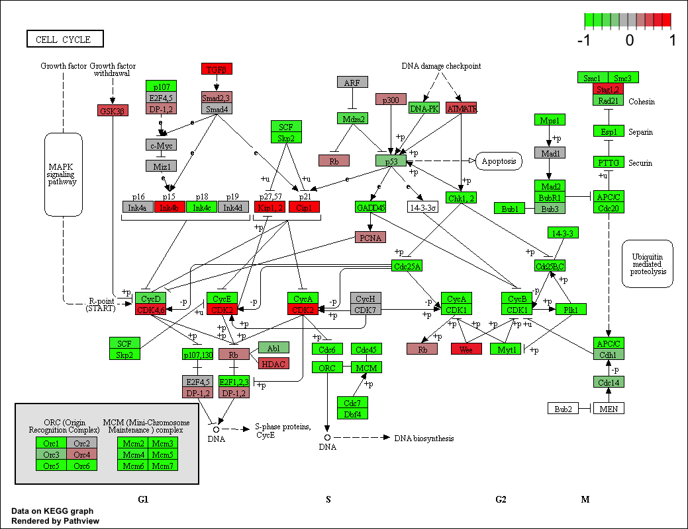
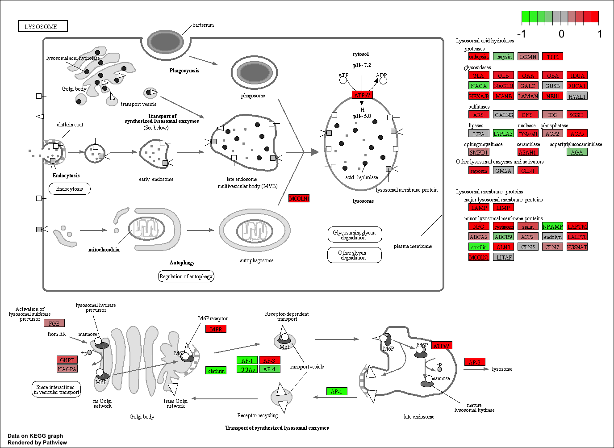
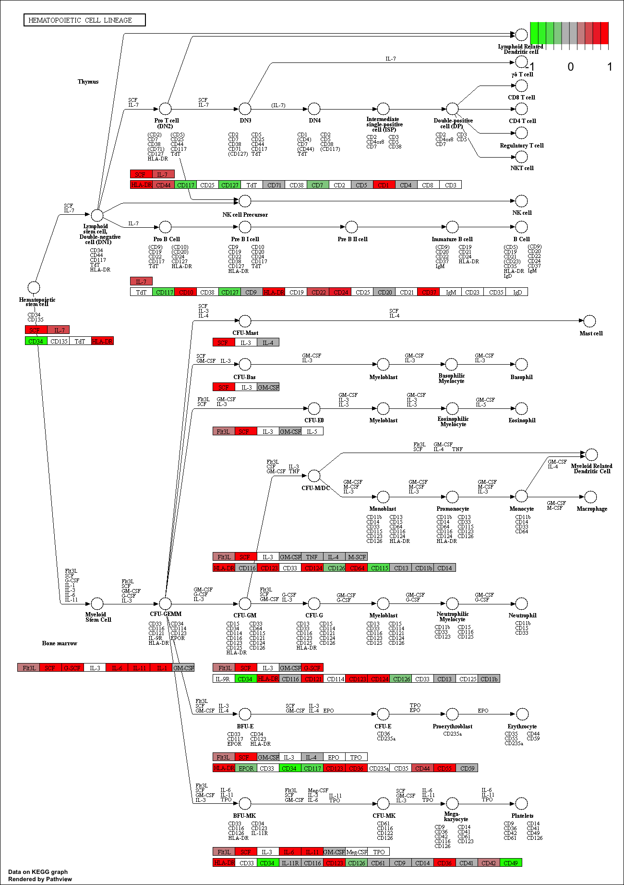
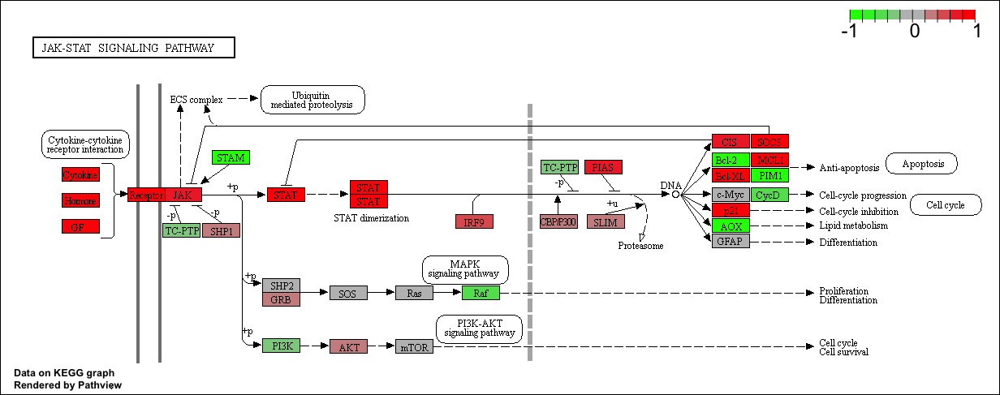
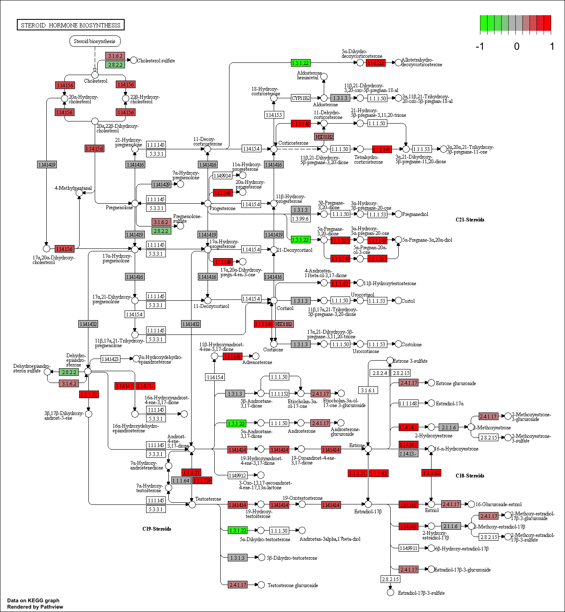
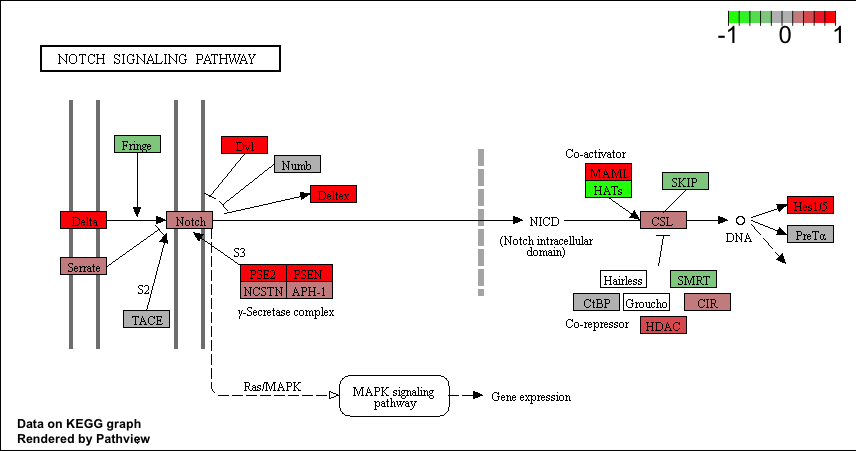

```{r setup, include=FALSE}
knitr::opts_chunk$set(echo = TRUE)
```
##Differential Expression Analysis

Load our data files
```{r}
metaFile <- "data/GSE37704_metadata.csv"
countFile <-"data/GSE37704_featurecounts.csv"

#Import metadata
colData = read.csv(metaFile, row.names = 1)
head(colData)

#Import countdata
countData = read.csv(countFile, row.names = 1)
countData = as.matrix(countData[,-1])
head(countData)
```

Check that my metadata and coldata columns are equal
```{r}
all(row.names(colData) == colnames(countData))
```

Lets remove genes that we do not have data for (e.g. zeros across all columns)
```{r}
inds <- rowSums(countData) != 0
countData = countData[inds,]
head(countData)
```

## Running DESeq2

```{r deseq_load, message=FALSE}
library("DESeq2")
```


```{r}
dds = DESeqDataSetFromMatrix(countData = countData, colData = colData, 
                              design =~condition)
dds = DESeq(dds)
```
Lets get our results
```{r}
res = results(dds,contrast = c("condition", "hoxa1_kd", "control_sirna"))
summary(res)
```

Lets make our volcano plot

```{r}
plot(res$log2FoldChange, -log(res$padj))
```


```{r}
mycols <- rep("lightblue", nrow(res))
mycols[abs(res$log2FoldChange )> 2] <- "hotpink"
inds <- (abs(res$log2FoldChange) > 2) & (res$padj < 0.01)
mycols[inds] <- "purple"
plot(res$log2FoldChange, -log(res$padj), col = mycols)

```


```{r, eval = FALSE}
source("http://bioconductor.org/biocLite.R")
biocLite("AnnotationDbi")
biocLite("org.Hs.eg.db")
```


```{r message=FALSE}
library("AnnotationDbi")
library("org.Hs.eg.db")

columns(org.Hs.eg.db)
```


```{r}
res$symbol = mapIds(org.Hs.eg.db, keys = row.names(res) , keytype = "ENSEMBL",
                      column = "SYMBOL", multiVals = "first")
res$entrez = mapIds(org.Hs.eg.db, keys = row.names(res), keytype = "ENSEMBL",
                      column = "ENTREZID", multiVals = "first")
res$name = mapIds(org.Hs.eg.db, keys = row.names(res), keytype = "ENSEMBL",
                      column = "GENENAME", multiVals = "first")

head(res)
```

```{r}
res = res[order(res$pvalue),]
write.csv(res, file = "deseq_results.csv")
```

##Pathway Analysis
```{r, eval = FALSE}
biocLite(c("pathview", "gage", "gageData"))
```


```{r message=FALSE}
library(pathview)
library(gage)
library(gageData)
```


```{r}
data(kegg.sets.hs)
data(sigmet.idx.hs)

#Focus on signaling and metabolic pathways only 
kegg.sets.hs = kegg.sets.hs[sigmet.idx.hs]

#Examine the first 3 pathways
head(kegg.sets.hs, 3)
```

The main *gage()* function requires a named vector of fold  changes, where the names of the values are the Entrez gene IDs.

Note that we used the mapIDs() function above to obtain Entrez gene IDs (stored in res$entrez) and we have the fold change results from DESeq2 analysis (stored in res$log2FoldChange).

```{r}
foldchanges = res$log2FoldChange
names(foldchanges) = res$entrez
head(foldchanges)
```

Now lets run *gage* pathway analysis
```{r}
#Get results
keggres = gage(foldchanges, gsets = kegg.sets.hs)
```

```{r}
attributes(keggres)
```

```{r}
#Look a the first few down(less) pathways
head(keggres$less)
```

```{r}
pathview(gene.data = foldchanges, pathway.id = "hsa04110")
```



```{r}
##Focus on the top 5 upregulated pathways here for demo purposes
keggrespathways <- rownames(keggres$greater)[1:5]

#Extract the 8 character long IDs part of each string
keggresids = substr(keggrespathways,start = 1, stop = 8)
keggresids
```

Draw plots for the top 5 upregulated pathways
```{r}
pathview(gene.data = foldchanges, pathway.id = keggresids, species = "hsa")
```

Here are the 5 plots:








