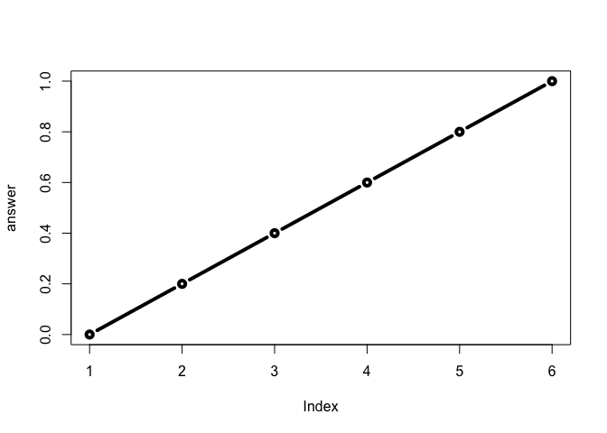

Class 6
================
Paige Dubelko
January 24, 2019

### Section 1: Reading files

We are using the **read.table()** funtion and friends to read some example flat files.

``` r
read.csv("test1.txt")
```

    ##   Col1 Col2 Col3
    ## 1    1    2    3
    ## 2    4    5    6
    ## 3    7    8    9
    ## 4    a    b    c

For the test1 file, we are able to use read.table(), but because we notice it is separated by "," and appears to have a header, the **read.csv** is a simpler option.

We will now look at our **second** text file... We see that this file is separated by '$' and has a header.

``` r
read.table("test2.txt", header = TRUE, sep = "$")
```

    ##   Col1 Col2 Col3
    ## 1    1    2    3
    ## 2    4    5    6
    ## 3    7    8    9
    ## 4    a    b    c

Because we do not have a friend function that separates by "$" it is easy to edit table to specify it for this file.

Now onto the **third** file. We notice that the data is separated by what looks like spaces and does not have a header. So we just use the **read.table()** function.

``` r
read.table("test3.txt")
```

    ##   V1 V2 V3
    ## 1  1  6  a
    ## 2  2  7  b
    ## 3  3  8  c
    ## 4  4  9  d
    ## 5  5 10  e

### Section 2: R Functions

Lets write a simple function, add()...

``` r
add <- function(x,y=1){
  #Sum the input x and y
  x + y
}
```

Now lets try add()!

``` r
x <- 7
y <- 3
add(7,3)
```

    ## [1] 10

We are also able to use our add function with vectors :) Remember: the y variable is optional.

``` r
add(c(1,2,3))
```

    ## [1] 2 3 4

If you find yourself doing the same thing three or more times, it might be time to think about writing a function.

**2nd Function: Rescale**

``` r
rescale <- function(x){
  rng <- range(x)
  (x - rng[1]) / (rng[2] - rng[1])
}
```

Lets test on a small example, where we know what the answer should be

``` r
rescale(1:10)
```

    ##  [1] 0.0000000 0.1111111 0.2222222 0.3333333 0.4444444 0.5555556 0.6666667
    ##  [8] 0.7777778 0.8888889 1.0000000

With how it is currently written, our rescale function will not take NA values, so we must change it.

``` r
rescale2 <- function(x){
  rng <- range(x, na.rm = TRUE)
  (x - rng[1]) / (rng[2] - rng[1])
}
```

This will now work for vectors containing NA values because we set **na.rm** equal to TRUE

``` r
x <- c(1,2,NA,3,10)
rescale2(x)
```

    ## [1] 0.0000000 0.1111111        NA 0.2222222 1.0000000

Lets edit this function one more time.

``` r
rescale3 <- function(x, na.rm = TRUE, plot = FALSE){
  rng <- range(x, na.rm = na.rm)
  print("Hello")
  
  answer <- (x - rng[1]) / (rng[2] - rng[1])
  
  print("is it me you are looking for?")
  
  if(plot){
    plot(answer, typ = "b", lwd = 4)
  }
  print("I can see it in ...")
  return(answer)
}
```

Lets try it!

``` r
rescale3(c(1:6), plot = TRUE)
```

    ## [1] "Hello"
    ## [1] "is it me you are looking for?"



    ## [1] "I can see it in ..."

    ## [1] 0.0 0.2 0.4 0.6 0.8 1.0
