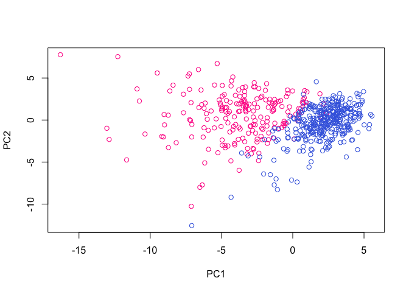

Class 9: Analysis of Human Breast Cancer Cells
================
Paige Dubelko
February 7, 2019

Today we will be doing an unsupervising learning analysis of Human Breast Cancer Cells.

We have been given this information from the *Wisconsin Breast Cancer Diagnostic Data Set*

``` r
#Lets read in and save our new data directory
wisc.df<- read.csv("WisconsinCancer.csv")
#head(wisc.df)

#if you want to see how many patients are in the data set, check num of rows
#nrow(wisc.df)
```

We now want to convert our read in file to a matrix.

``` r
#Convert columns 3-32
#Lets now convert the columns of data into a matrix
wisc.data <- as.matrix(wisc.df[,3:32])
```

To keep track of different observations throughout modeling, assign row names of *wisc.data* to the values contained in *id* column of *wisc.df*

``` r
#Assign row names
row.names(wisc.data) <- wisc.df$id
#head(wisc.data)
```

We now want to create a new vector **Diagnosis** that will be 1 if a diagnosis is malignant and 0 otherwise.

``` r
diagnosis <- as.numeric(wisc.df$diagnosis == "M")
```

Let's explore the data a little bit. Q1: How many observations are in this dataset

``` r
nrow(wisc.df)
```

    ## [1] 569

Q2: How many variables/features in the data are suffixed with \_mean:

``` r
#Looking for columns ending w _mean
inds <- grep("_mean", colnames(wisc.data))
length(inds)
```

    ## [1] 10

Q3: How many observations have malignant diagnosis?

``` r
table(wisc.df$diagnosis)
```

    ## 
    ##   B   M 
    ## 357 212

``` r
#or use

sum(diagnosis)
```

    ## [1] 212

Section 2: Principal Component Analysis
=======================================

Lets first check if the data needs to be scaled.

``` r
colMeans(wisc.data)
```

    ##             radius_mean            texture_mean          perimeter_mean 
    ##            1.412729e+01            1.928965e+01            9.196903e+01 
    ##               area_mean         smoothness_mean        compactness_mean 
    ##            6.548891e+02            9.636028e-02            1.043410e-01 
    ##          concavity_mean     concave.points_mean           symmetry_mean 
    ##            8.879932e-02            4.891915e-02            1.811619e-01 
    ##  fractal_dimension_mean               radius_se              texture_se 
    ##            6.279761e-02            4.051721e-01            1.216853e+00 
    ##            perimeter_se                 area_se           smoothness_se 
    ##            2.866059e+00            4.033708e+01            7.040979e-03 
    ##          compactness_se            concavity_se       concave.points_se 
    ##            2.547814e-02            3.189372e-02            1.179614e-02 
    ##             symmetry_se    fractal_dimension_se            radius_worst 
    ##            2.054230e-02            3.794904e-03            1.626919e+01 
    ##           texture_worst         perimeter_worst              area_worst 
    ##            2.567722e+01            1.072612e+02            8.805831e+02 
    ##        smoothness_worst       compactness_worst         concavity_worst 
    ##            1.323686e-01            2.542650e-01            2.721885e-01 
    ##    concave.points_worst          symmetry_worst fractal_dimension_worst 
    ##            1.146062e-01            2.900756e-01            8.394582e-02

``` r
apply(wisc.data,2,sd)
```

    ##             radius_mean            texture_mean          perimeter_mean 
    ##            3.524049e+00            4.301036e+00            2.429898e+01 
    ##               area_mean         smoothness_mean        compactness_mean 
    ##            3.519141e+02            1.406413e-02            5.281276e-02 
    ##          concavity_mean     concave.points_mean           symmetry_mean 
    ##            7.971981e-02            3.880284e-02            2.741428e-02 
    ##  fractal_dimension_mean               radius_se              texture_se 
    ##            7.060363e-03            2.773127e-01            5.516484e-01 
    ##            perimeter_se                 area_se           smoothness_se 
    ##            2.021855e+00            4.549101e+01            3.002518e-03 
    ##          compactness_se            concavity_se       concave.points_se 
    ##            1.790818e-02            3.018606e-02            6.170285e-03 
    ##             symmetry_se    fractal_dimension_se            radius_worst 
    ##            8.266372e-03            2.646071e-03            4.833242e+00 
    ##           texture_worst         perimeter_worst              area_worst 
    ##            6.146258e+00            3.360254e+01            5.693570e+02 
    ##        smoothness_worst       compactness_worst         concavity_worst 
    ##            2.283243e-02            1.573365e-01            2.086243e-01 
    ##    concave.points_worst          symmetry_worst fractal_dimension_worst 
    ##            6.573234e-02            6.186747e-02            1.806127e-02

``` r
wisc.pr <- prcomp(wisc.data, scale = TRUE)

summary(wisc.pr)
```

    ## Importance of components:
    ##                           PC1    PC2     PC3     PC4     PC5     PC6
    ## Standard deviation     3.6444 2.3857 1.67867 1.40735 1.28403 1.09880
    ## Proportion of Variance 0.4427 0.1897 0.09393 0.06602 0.05496 0.04025
    ## Cumulative Proportion  0.4427 0.6324 0.72636 0.79239 0.84734 0.88759
    ##                            PC7     PC8    PC9    PC10   PC11    PC12
    ## Standard deviation     0.82172 0.69037 0.6457 0.59219 0.5421 0.51104
    ## Proportion of Variance 0.02251 0.01589 0.0139 0.01169 0.0098 0.00871
    ## Cumulative Proportion  0.91010 0.92598 0.9399 0.95157 0.9614 0.97007
    ##                           PC13    PC14    PC15    PC16    PC17    PC18
    ## Standard deviation     0.49128 0.39624 0.30681 0.28260 0.24372 0.22939
    ## Proportion of Variance 0.00805 0.00523 0.00314 0.00266 0.00198 0.00175
    ## Cumulative Proportion  0.97812 0.98335 0.98649 0.98915 0.99113 0.99288
    ##                           PC19    PC20   PC21    PC22    PC23   PC24
    ## Standard deviation     0.22244 0.17652 0.1731 0.16565 0.15602 0.1344
    ## Proportion of Variance 0.00165 0.00104 0.0010 0.00091 0.00081 0.0006
    ## Cumulative Proportion  0.99453 0.99557 0.9966 0.99749 0.99830 0.9989
    ##                           PC25    PC26    PC27    PC28    PC29    PC30
    ## Standard deviation     0.12442 0.09043 0.08307 0.03987 0.02736 0.01153
    ## Proportion of Variance 0.00052 0.00027 0.00023 0.00005 0.00002 0.00000
    ## Cumulative Proportion  0.99942 0.99969 0.99992 0.99997 1.00000 1.00000

**Q4: From results, what proportion of the original variance is captured by the first principal components (PC1)?** From looking at the summary section *Proportion of Variance* we see PC1 covers 44.27%

**Q5. How many principal components (PCs) are required to describe at least 70% of the original variance in the data?** By PC3 we see more than 70% of original variance

**Q6. How many principal components (PCs) are required to describe at least 90% of the original variance in the data?** By PC7 we have covered 90%

Now we want to interpret our PCA results:

``` r
biplot(wisc.pr)
```

 We see that rownames in the biplot make any trends very difficult to see. So it might be better to generate a standard scatter plot

``` r
palette(c("royalblue", "deeppink", "red"))
plot(wisc.pr$x[,1],wisc.pr$x[,2], col = diagnosis+1, xlab = "PC1", ylab = "PC2")
```



Lets see a plot of PC1 and PC3!

``` r
palette(c("plum2", "powderblue"))
plot(wisc.pr$x[,1], wisc.pr$x[,3], xlab = "PC1", ylab = "PC3", col = diagnosis + 1 )
```


Lets discuss Variance a bit more: A good way to pick a natrual number of principal components is by looking at a scree plot and look for the "elbow".

``` r
#Lets calculate variance of each principal component
pr.var <- wisc.pr$sdev^2
head(pr.var)
```

    ## [1] 13.281608  5.691355  2.817949  1.980640  1.648731  1.207357

We now want to divide by the total variance of all principal components:

``` r
pve <- round((pr.var/sum(pr.var))*100,1)

plot(pve, xlab = "Principal Component", ylab = "Proportion of Variance Explained", ylim = c(0,100), type = "o")
```


We can also barplot this data:

``` r
barplot(pve,ylab = "Precent of Variance Explained", names.arg = paste0("PC", 1:length(pve)), las = 2, axes = FALSE, col = rainbow(ncol(wisc.pr$x)))

axis(2,at = pve, labels = round(pve,2)*100)
```


Plot the cumulative proportion of variance:

``` r
plot(cumsum(pve), xlab = "Principal Component", 
     ylab = "Cumulative Proportion of Variance Explained", 
     ylim = c(0, 100), type = "o")
```


Hierarchical Clustering of Case Data
====================================

``` r
data.scaled <- scale(wisc.data)

data.dist <- dist(data.scaled)

wisc.hclust <- hclust(data.dist, method = "complete")
```

Now lets plot our clustering

``` r
plot(wisc.hclust)

abline(a = 19 , b = 0, col = "cornflowerblue", lty = 2)
```


Lets compare outputs from clustering to actual diagnoses. We will use **cutree()** to do so:

``` r
wisc.hclust.clusters <- cutree(wisc.hclust, k = 3)
```

Use **table()** function to compare cluster membership:

``` r
table(wisc.hclust.clusters, diagnosis)
```

    ##                     diagnosis
    ## wisc.hclust.clusters   0   1
    ##                    1 355 205
    ##                    2   2   5
    ##                    3   0   2

Cluster in PCA Results:
-----------------------

For clustering we need: 1. Distance Matrix 2. Clustering Function 3. Cut Tree

``` r
dist.pca <- dist(wisc.pr$x[,1:2])

pc.hclust <- hclust(dist.pca, method = "ward.D2")
plot(pc.hclust)
```


``` r
cut.pc <- cutree(pc.hclust, k = 3)
table(cut.pc, diagnosis)
```

    ##       diagnosis
    ## cut.pc   0   1
    ##      1   0 112
    ##      2  18  65
    ##      3 339  35

``` r
palette(c("steelblue1", "mediumpurple1", "lightsalmon1"))
plot(wisc.pr$x[,1:2], col = cut.pc)
```


Prediction
----------

We are going to use function **predict()** that will take our PCA model from before and new cancer cell data and project the data onto our PCA space.

``` r
url <- "https://tinyurl.com/new-samples-CSV"
new <- read.csv(url)
npc <- predict(wisc.pr, newdata = new)
```

``` r
palette(c("darkorchid", "hotpink2"))
plot(wisc.pr$x[,1:2], col = diagnosis+1)
points(npc[,1], npc[,2], col = "lightgoldenrod", pch = 16, cex = 2)
```


From the data seen above, doctors should prioritize following up with the patient falling in the purple region.
