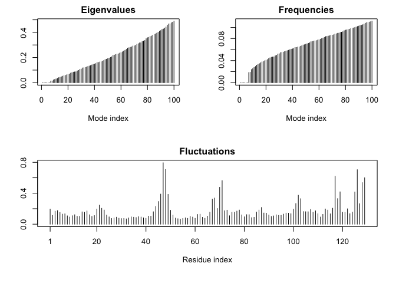

Class 13: Structure Based Drug Discovery
================
Paige Dubelko
February 19, 2019

Prepare HIV-Protease molecule for docking
-----------------------------------------

First get a PDB structure from the online database then clean it up for docking.

``` r
library(bio3d)
file.name <- get.pdb("1hsg")
```

    ## Warning in get.pdb("1hsg"): ./1hsg.pdb exists. Skipping download

Read in PDB file, look at preview, & remove non- protein bits and will save ligand into a separate file.

``` r
hiv <- read.pdb(file.name)
hiv
```

    ## 
    ##  Call:  read.pdb(file = file.name)
    ## 
    ##    Total Models#: 1
    ##      Total Atoms#: 1686,  XYZs#: 5058  Chains#: 2  (values: A B)
    ## 
    ##      Protein Atoms#: 1514  (residues/Calpha atoms#: 198)
    ##      Nucleic acid Atoms#: 0  (residues/phosphate atoms#: 0)
    ## 
    ##      Non-protein/nucleic Atoms#: 172  (residues: 128)
    ##      Non-protein/nucleic resid values: [ HOH (127), MK1 (1) ]
    ## 
    ##    Protein sequence:
    ##       PQITLWQRPLVTIKIGGQLKEALLDTGADDTVLEEMSLPGRWKPKMIGGIGGFIKVRQYD
    ##       QILIEICGHKAIGTVLVGPTPVNIIGRNLLTQIGCTLNFPQITLWQRPLVTIKIGGQLKE
    ##       ALLDTGADDTVLEEMSLPGRWKPKMIGGIGGFIKVRQYDQILIEICGHKAIGTVLVGPTP
    ##       VNIIGRNLLTQIGCTLNF
    ## 
    ## + attr: atom, xyz, seqres, helix, sheet,
    ##         calpha, remark, call

Use *trimb.pdb()* function to trim pdbs to proteins & ligands

``` r
prot <- trim.pdb(hiv, 'protein')
lig <- trim.pdb(hiv, 'ligand')
```

Now write them out to new files

``` r
write.pdb(prot, file = "1hsg_protein.pdb")
write.pdb(lig, file = "1hsg_ligand.pdb")
```

Inspecting our Docking Results
------------------------------

``` r
res <- read.pdb("all.pdbqt", multi = TRUE)
write.pdb(res,"results.pdb")
```

``` r
ori <- read.pdb("ligand.pdbqt")
rmsd(ori,res)
```

    ##  [1]  0.707 10.432 11.138 10.809 10.946 10.428 10.497  4.283  4.264  4.367
    ## [11] 10.994 10.416  5.897  8.288 10.855 11.186  5.440  6.492  9.494 11.225

Normal Mode Analysis
--------------------

``` r
library(bio3d)
pdb <- read.pdb("1HEL")
```

    ##   Note: Accessing on-line PDB file

``` r
modes <- nma(pdb)
```

    ##  Building Hessian...     Done in 0.027 seconds.
    ##  Diagonalizing Hessian...    Done in 0.141 seconds.

``` r
plot(modes)
```



``` r
mktrj(modes, mode = 7, file = "nma_7.pdb")
```
